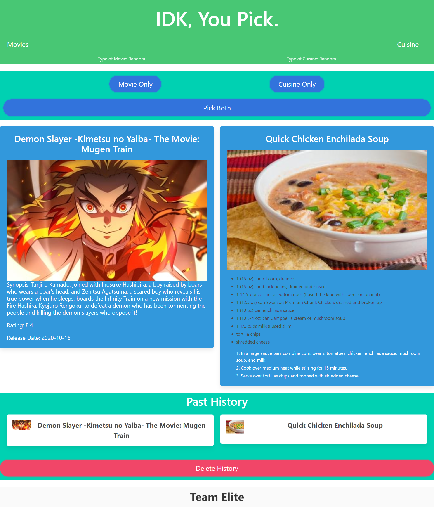
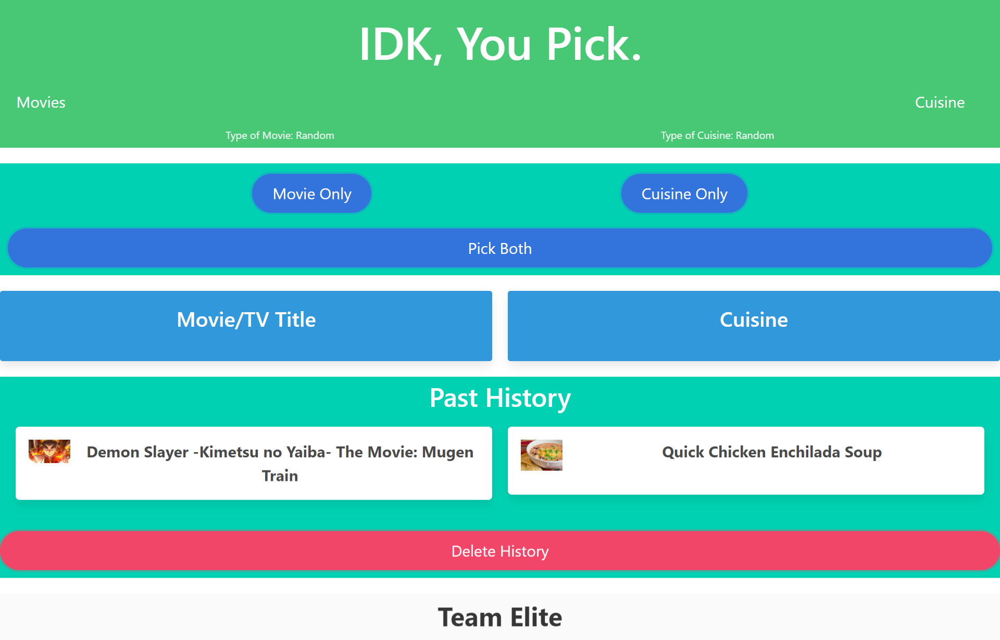
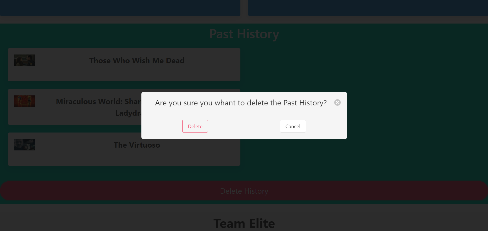

# IDK, You Pick

## Description

    The motivation for this project was to create a web page that will help you decide what movie and cuisien pick for you for a movie date night. The application will randomly pick a movie depending on what type of category you choose and the same goes for the type of cuisine. You can either just pick one of each seperatly or both at the same time.

## Usage

    On the Page you will see a top section with the title of the page and 2 drop down buttons that will display what type of movie and cuisine you will choose, below the header there is a bigger button section with 3 differen button one for picking only the movie another one for only picking the cuisine and the last one it will pick both at the smae time. Underneath it will appear side by side the generated movie with the title, an image of the movie, a brief description of the movie, rating and the realese date; similar one the right side it will show the name of the cuisine plate, an image, a list of ingridients and the recipe guide step by step. At the end it will save you the last 3 past searches for both movie and cuise in case you need to go back review them.

## Links, Screenshots & API

 * [IDK, You Pick Page Web Page](https://arielo5.github.io/Group-Collaboration/)

 * Screenshots of the web pages

    
    
    
    

 * API web pages

    * [Movie API Web Page](https://www.themoviedb.org/documentation/api)

    * [Recipe API Page Web Page](https://spoonacular.com/food-api)
    

## Repo Content
* css (folder)
    * style.css
    * reset.css
* images (folder)
* javascript (folder)
    * scrips.js 
* README.md

## MIT License

Copyright (c) 2021 Ariel Martinez 

Permission is hereby granted, free of charge, to any person obtaining a copy
of this software and associated documentation files (the "Software"), to deal
in the Software without restriction, including without limitation the rights
to use, copy, modify, merge, publish, distribute, sublicense, and/or sell
copies of the Software, and to permit persons to whom the Software is
furnished to do so, subject to the following conditions:

The above copyright notice and this permission notice shall be included in all
copies or substantial portions of the Software.

THE SOFTWARE IS PROVIDED "AS IS", WITHOUT WARRANTY OF ANY KIND, EXPRESS OR
IMPLIED, INCLUDING BUT NOT LIMITED TO THE WARRANTIES OF MERCHANTABILITY,
FITNESS FOR A PARTICULAR PURPOSE AND NONINFRINGEMENT. IN NO EVENT SHALL THE
AUTHORS OR COPYRIGHT HOLDERS BE LIABLE FOR ANY CLAIM, DAMAGES OR OTHER
LIABILITY, WHETHER IN AN ACTION OF CONTRACT, TORT OR OTHERWISE, ARISING FROM,
OUT OF OR IN CONNECTION WITH THE SOFTWARE OR THE USE OR OTHER DEALINGS IN THE
SOFTWARE.
* index.html
